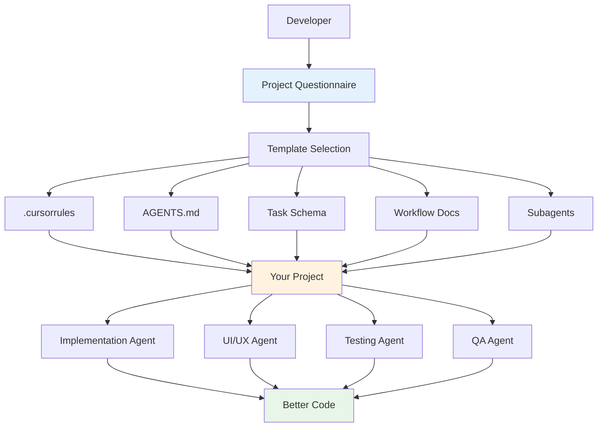

# Multi-Agent Development System Template

**Version**: 1.0.0  
**Last Updated**: January 2026

## 📍 Installation

This is a **standalone template package** designed to be installed once and used across multiple projects.

**Quick Install**:
```bash
# Place template in a central location
cd ~/dev
# Copy/move multi-agent-system-template here

# Add to ~/.zshrc or ~/.bashrc:
export TEMPLATE_DIR=~/dev/multi-agent-system-template
```

**For detailed installation options**: See [INSTALLATION.md](./INSTALLATION.md)

## 📖 What is This?

A comprehensive, modular template kit for implementing a **multi-agent development system** in any software project. Enable specialized AI agents to collaborate on implementation, design, testing, and quality assurance for better code quality and faster development.

## 🎯 Key Features

- **Universal**: Works with mobile apps, web apps, backend services, and full-stack projects
- **Project Maturity Aware**: Supports greenfield, existing codebases, MVP imports, and legacy systems
- **Ingestion & Modernization**: Specialized agents reverse-engineer documentation from existing code
- **Modular**: Use components independently or together
- **Customizable**: Templates adapt to your tech stack and architecture
- **Guided Setup**: Step-by-step process with decision paths for different project states
- **Production-Ready**: Based on real-world multi-agent systems in active development
- **Well-Documented**: Comprehensive guides, examples, and troubleshooting

### Special Capabilities for Existing Projects

If you have existing code but missing documentation:
- **Codebase Auditor Agent**: Analyzes code structure and builds knowledge graph
- **Gap Analysis Agent**: Identifies security issues, infrastructure gaps, and production blockers
- **Documentation Backfill Agent**: Generates Product Design Blueprint (PDB) and Technical Architecture (TAD) from code

Perfect for:
- MVP imports from Replit, Bolt, V0, or similar tools
- Legacy systems that need documentation
- Existing projects transitioning to multi-agent development

## 🚀 Quick Start

### Choose Your Path

- **⚡ 5-Minute Setup** (experienced): [QUICK_START.md](./QUICK_START.md)
- **📋 30-Minute Setup** (recommended): [SETUP_GUIDE.md](./SETUP_GUIDE.md)
- **📝 Guided Setup** (first time): Start with [PROJECT_QUESTIONNAIRE.md](./PROJECT_QUESTIONNAIRE.md)

### Installation

**Important**: This template package should be placed in a central location accessible to all your projects.

```bash
# Recommended locations:
# - ~/dev/multi-agent-system-template
# - ~/templates/multi-agent-system-template
# - /path/to/shared/multi-agent-system-template

# Then set in your shell:
export TEMPLATE_DIR=~/dev/multi-agent-system-template
```

### Basic Workflow

1. **Identify**: Determine your project type (mobile/web/backend/full-stack)
2. **Select**: Choose appropriate templates from `templates/` directory
3. **Customize**: Replace `{{VARIABLES}}` with your project details
4. **Deploy**: Copy customized files to your project
5. **Test**: Verify agents work correctly

## 📦 What's Included

### Core Templates

| Component | Description | Location |
|-----------|-------------|----------|
| **.cursorrules** | Workspace-level AI agent rules | `templates/cursorrules/` |
| **AGENTS.md** | Agent role definitions and workflows | `templates/agents/` |
| **Task Schema** | Task tracking with agent integration | `templates/tasks/` |
| **Workflow Docs** | Agent collaboration patterns | `templates/workflow/` |
| **Subagent Configs** | Specialized AI assistant prompts | `templates/subagents/` |

### Support Files

- **Setup Guide**: Comprehensive setup instructions
- **Integration Guide**: How all components work together
- **Customization Guide**: How to adapt templates
- **Troubleshooting**: Common issues and solutions
- **FAQ**: Frequently asked questions
- **Examples**: Complete setups for different project types

## 🏗️ System Architecture



## 🎨 Supported Project Types

### Mobile Apps
- **Flutter**: Riverpod, Material/Cupertino, Firebase
- **React Native**: Redux/MobX, React Navigation
- **Native iOS**: SwiftUI/UIKit, Combine, Core Data
- **Native Android**: Jetpack Compose, Kotlin Coroutines, Room

### Web Apps
- **React**: Context/Redux, React Router, REST/GraphQL
- **Vue**: Pinia/Vuex, Vue Router, Composition API
- **Angular**: RxJS, Angular Router, Services
- **Svelte**: Stores, SvelteKit routing

### Backend Services
- **Node.js**: Express/Fastify, Sequelize/TypeORM, JWT
- **Python**: Django/FastAPI, SQLAlchemy, async patterns
- **Java**: Spring Boot, JPA/Hibernate, microservices
- **Go**: Gin/Echo, GORM, goroutines

### Full-Stack
- **Next.js**: App Router, Server Components, API routes
- **Nuxt**: Pages, Server Middleware, Nitro
- **SvelteKit**: File-based routing, Server endpoints
- **Remix**: Loaders/Actions, Progressive enhancement

## 📚 Documentation

### Getting Started
- [SETUP_GUIDE.md](./SETUP_GUIDE.md) - Complete setup instructions
- [PROJECT_QUESTIONNAIRE.md](./PROJECT_QUESTIONNAIRE.md) - Project identification

### Integration & Usage
- [docs/INTEGRATION_GUIDE.md](./docs/INTEGRATION_GUIDE.md) - How components work together
- [docs/CUSTOMIZATION_GUIDE.md](./docs/CUSTOMIZATION_GUIDE.md) - How to customize templates

### Reference
- [docs/TROUBLESHOOTING.md](./docs/TROUBLESHOOTING.md) - Common issues and solutions
- [docs/FAQ.md](./docs/FAQ.md) - Frequently asked questions

### Examples
- [examples/mobile-app-example/](./examples/mobile-app-example/) - Flutter app setup
- [examples/web-app-example/](./examples/web-app-example/) - React app setup
- [examples/backend-service-example/](./examples/backend-service-example/) - Node.js API setup
- [examples/full-stack-example/](./examples/full-stack-example/) - Next.js app setup

## 🤖 Agent Roles

The system supports flexible agent configurations. Common roles include:

### Core Agents (Universal)
- **Implementation Agent**: Business logic, services, data models
- **Quality Assurance Agent**: Code review, style, security, architecture
- **Testing Agent**: Unit tests, integration tests, test coverage

### Frontend Agents (Web/Mobile)
- **UI/UX Agent**: Design system, accessibility, responsive layouts
- **Design System Agent**: Component library, theming, consistency
- **Performance Agent**: Bundle optimization, lazy loading

### Backend Agents (APIs/Services)
- **API Agent**: Endpoints, validation, error handling
- **Database Agent**: Schema, migrations, queries, indexes
- **Security Agent**: Auth, authorization, rate limiting

## 🔧 Template Variables

Templates use a consistent variable syntax for customization:

**Required Variables**:
- `{{PROJECT_NAME}}` - Project name
- `{{PROJECT_TYPE}}` - mobile-app | web-app | backend | full-stack
- `{{PRIMARY_LANGUAGE}}` - Main programming language
- `{{FRAMEWORK}}` - Primary framework
- `{{ARCHITECTURE_PATTERN}}` - Clean Architecture | MVC | MVVM | etc.

**Optional Variables**:
- `{{STATE_MANAGEMENT}}` - State management approach
- `{{DATABASE_TYPE}}` - Database system
- `{{BACKEND}}` - Backend infrastructure
- And more...

See [SETUP_GUIDE.md - Variable Reference](./SETUP_GUIDE.md#variable-reference) for complete list.

## 📋 File Structure

```
multi-agent-system-template/
├── README.md                          # This file
├── SETUP_GUIDE.md                     # Complete setup instructions
├── PROJECT_QUESTIONNAIRE.md           # Project identification
│
├── templates/
│   ├── cursorrules/
│   │   ├── base-template.cursorrules          # Generic base
│   │   ├── mobile-app.cursorrules             # Mobile-specific
│   │   ├── web-app.cursorrules                # Web-specific
│   │   ├── backend-service.cursorrules        # Backend-specific
│   │   └── full-stack.cursorrules             # Full-stack-specific
│   │
│   ├── agents/
│   │   ├── AGENTS-base.md                     # Generic agent roles
│   │   ├── AGENTS-mobile.md                   # Mobile app agents
│   │   ├── AGENTS-web.md                      # Web app agents
│   │   ├── AGENTS-backend.md                  # Backend agents
│   │   └── AGENTS-full-stack.md               # Full-stack agents
│   │
│   ├── tasks/
│   │   ├── tasks-schema.yml                   # Portfolio-level schema
│   │   ├── feature-task-template.yml          # Per-feature template
│   │   └── TASK_SCHEMA_GUIDE.md               # Schema documentation
│   │
│   ├── workflow/
│   │   ├── MULTI_AGENT_WORKFLOW.md            # Workflow patterns
│   │   ├── SCHEMA_CONVENTIONS.md              # Data modeling (optional)
│   │   └── DEVELOPMENT_WORKFLOW.md            # General workflow
│   │
│   └── subagents/
│       ├── generic/                            # Universal subagents
│       │   ├── code-reviewer.md
│       │   ├── designer.md                     # UI/UX, design system, accessibility
│       │   ├── test-writer.md
│       │   ├── debugger.md
│       │   ├── doc-generator.md
│       │   ├── security-auditor.md
│       │   └── performance-optimizer.md
│       │
│       └── specialists/                        # Tech-specific templates
│           ├── flutter-specialist.md
│           ├── react-specialist.md
│           ├── django-specialist.md
│           ├── node-specialist.md
│           └── specialist-template.md          # Blank template
│
├── examples/
│   ├── mobile-app-example/                    # Complete Flutter setup
│   ├── web-app-example/                       # Complete React setup
│   ├── backend-service-example/               # Complete Node.js setup
│   └── full-stack-example/                    # Complete Next.js setup
│
└── docs/
    ├── INTEGRATION_GUIDE.md                   # How components work together
    ├── CUSTOMIZATION_GUIDE.md                 # How to customize templates
    ├── TROUBLESHOOTING.md                     # Common issues and solutions
    └── FAQ.md                                 # Frequently asked questions
```

## 💡 Key Benefits

### For Solo Developers
- **Specialized Expertise**: Get expert guidance in different domains (code, design, testing)
- **Quality Assurance**: Automatic code review and best practices enforcement
- **Consistency**: Maintain patterns even across long development sessions
- **Learning**: Learn best practices from agent feedback

### For Teams
- **Shared Standards**: Codified conventions that all team members follow
- **Parallel Work**: Multiple agents can review different aspects simultaneously
- **Knowledge Transfer**: New team members learn patterns from agent guidance
- **Scalability**: Clear roles enable efficient task distribution

### For Projects
- **Better Code Quality**: Multi-perspective reviews catch more issues
- **Faster Development**: Specialized agents work efficiently in their domains
- **Maintainability**: Consistent patterns make code easier to maintain
- **Documentation**: Agents ensure documentation stays current

## ⚡ Quick Examples

### Mobile App (Flutter)
```bash
# 1. Copy mobile templates
cp templates/cursorrules/mobile-app.cursorrules .cursorrules
cp templates/agents/AGENTS-mobile.md AGENTS.md

# 2. Customize for your project
# Replace {{PROJECT_NAME}} with "MyApp"
# Replace {{FRAMEWORK}} with "Flutter"
# Replace {{STATE_MANAGEMENT}} with "Riverpod"

# 3. Set up subagents
mkdir -p .cursor/agents
cp templates/subagents/generic/*.md .cursor/agents/
cp templates/subagents/specialists/flutter-specialist.md .cursor/agents/
```

### Web App (React)
```bash
# Set template directory (adjust to where you placed the template)
TEMPLATE_DIR=/path/to/multi-agent-system-template

# 1. Copy web templates
cp $TEMPLATE_DIR/templates/cursorrules/web-app.cursorrules .cursorrules
cp $TEMPLATE_DIR/templates/agents/AGENTS-web.md AGENTS.md

# 2. Customize for your project
# Replace {{PROJECT_NAME}} with "MyWebApp"
# Replace {{FRAMEWORK}} with "React"
# Replace {{STATE_MANAGEMENT}} with "Redux Toolkit"

# 3. Set up subagents
mkdir -p .cursor/agents
cp $TEMPLATE_DIR/templates/subagents/generic/*.md .cursor/agents/
cp $TEMPLATE_DIR/templates/subagents/specialists/react-specialist.md .cursor/agents/
```

### Backend Service (Node.js)
```bash
# Set template directory (adjust to where you placed the template)
TEMPLATE_DIR=/path/to/multi-agent-system-template

# 1. Copy backend templates
cp $TEMPLATE_DIR/templates/cursorrules/backend-service.cursorrules .cursorrules
cp $TEMPLATE_DIR/templates/agents/AGENTS-backend.md AGENTS.md

# 2. Customize for your project
# Replace {{PROJECT_NAME}} with "MyAPI"
# Replace {{FRAMEWORK}} with "Express"
# Replace {{DATABASE_TYPE}} with "PostgreSQL"

# 3. Set up subagents
mkdir -p .cursor/agents
cp $TEMPLATE_DIR/templates/subagents/generic/*.md .cursor/agents/
cp $TEMPLATE_DIR/templates/subagents/specialists/node-specialist.md .cursor/agents/
```

## 🎓 Best Practices

### Do's ✅
1. Start with the questionnaire to identify your project type
2. Begin with 3 core agents (Implementation, Quality, Testing)
3. Customize templates gradually based on actual usage
4. Test agent invocation before committing configs
5. Use sequential workflows (one agent at a time) for complex features
6. Keep configs in version control
7. Update documentation as patterns evolve

### Don'ts ❌
1. Don't skip customization - generic templates won't capture project specifics
2. Don't create too many specialized agents initially
3. Don't leave `{{VARIABLE}}` placeholders in committed files
4. Don't mix sequential and parallel workflows simultaneously
5. Don't ignore agent feedback - iterate and refine

## 🐛 Common Issues

| Issue | Solution |
|-------|----------|
| Agents not activating | Check YAML frontmatter in subagent configs |
| Generic advice | Ensure templates are fully customized for your project |
| Task files ignored | Verify `.cursorrules` includes task workflow section |
| Variables remaining | Search for `{{` and replace all placeholders |
| Conflicting advice | Use sequential workflow, prioritize specialist agents |

See [docs/TROUBLESHOOTING.md](./docs/TROUBLESHOOTING.md) for detailed solutions.

## 📊 Success Metrics

Your multi-agent system is working well when:

- ✅ Agents auto-invoke appropriately for their domains
- ✅ Code reviews happen automatically after implementations
- ✅ Agents follow project-specific patterns consistently
- ✅ Development quality improves (fewer bugs, better architecture)
- ✅ Development velocity increases (faster feature completion)
- ✅ Team members understand and use agents effectively
- ✅ Documentation stays current with minimal manual effort

## 🔄 Version History

- **1.0.0** (Jan 2026) - Initial release
  - Complete template kit for mobile, web, backend, and full-stack
  - Comprehensive documentation and examples
  - Support for major frameworks and tech stacks

## 📄 License

This template is provided as-is for use in any project. Attribution appreciated but not required.

## 🙏 Credits

This template was developed from real-world multi-agent development experience and refined through practical application across multiple projects.

## 🚀 Get Started

Ready to implement a multi-agent system in your project?

1. **Start Here**: [PROJECT_QUESTIONNAIRE.md](./PROJECT_QUESTIONNAIRE.md)
2. **Follow Guide**: [SETUP_GUIDE.md](./SETUP_GUIDE.md)
3. **See Examples**: [examples/](./examples/)
4. **Get Help**: [docs/TROUBLESHOOTING.md](./docs/TROUBLESHOOTING.md)

**Estimated Setup Time**: 30 minutes for basic setup, 2-3 hours for full customization

---

**Questions?** See [docs/FAQ.md](./docs/FAQ.md) or [docs/TROUBLESHOOTING.md](./docs/TROUBLESHOOTING.md)
