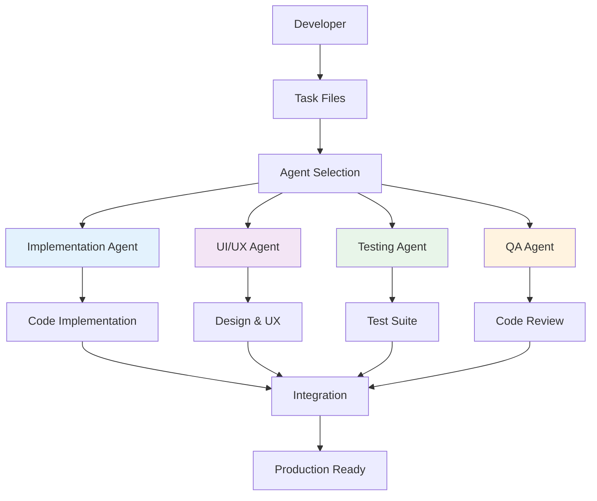

# Multi-Agent Development System - Setup Guide

**Version**: 1.0.0  
**Last Updated**: January 2026

## 📍 Template Location

This template package can be cloned or downloaded from your preferred location. Throughout this guide, we'll refer to the template root directory as `$TEMPLATE_DIR`.

**Recommended Setup**:
```bash
# Clone or place the template somewhere accessible
# Example locations:
# - ~/dev/multi-agent-system-template
# - ~/templates/multi-agent-system-template
# - /path/to/your/templates/multi-agent-system-template

export TEMPLATE_DIR=/path/to/multi-agent-system-template
```

## 📖 Overview

This guide will help you set up a **multi-agent development system** in your project. A multi-agent system enables specialized AI agents to collaborate on different aspects of development (implementation, design, testing) for better code quality, faster development, and consistent patterns.

### What is a Multi-Agent Development System?

A multi-agent system divides development work among specialized AI agents, each expert in their domain:

- **Implementation Agent**: Handles business logic, services, and core functionality
- **UI/UX Agent**: Focuses on design systems, accessibility, and user experience (for frontend projects)
- **Testing Agent**: Creates comprehensive test coverage and QA automation
- **Quality Assurance Agent**: Reviews code for style, security, and architecture compliance

### Key Benefits

1. **Specialized Expertise**: Each agent operates in their domain of mastery
2. **Parallel Development**: Multiple agents can work simultaneously on independent tasks
3. **Quality Assurance**: Multiple perspectives catch issues before production
4. **Consistency**: Shared context ensures all agents follow the same patterns
5. **Scalability**: Clear roles enable efficient task assignment and coordination
6. **Knowledge Transfer**: Agent guidelines document best practices for the team

### System Architecture



## 🎯 Prerequisites

Before setting up the multi-agent system, ensure you have:

- **Active Project**: An existing or new software project
- **Cursor IDE**: The multi-agent system is designed for Cursor
- **Project Documentation**: Basic understanding of your project's architecture and goals (or willingness to generate it)
- **Version Control**: Git repository for tracking changes

## 🔀 Project Maturity Decision Path

**CRITICAL**: Your setup path depends on your project's current state. Choose your path below:

### Path A: Net New Project (Green Field)
**Starting from absolute scratch - no code, no docs**

**Setup Flow**:
1. Complete PROJECT_QUESTIONNAIRE.md
2. Create Product Design Blueprint (PDB) first
3. Set up multi-agent system with standard templates
4. Use agents to implement from PDB

**Recommended Agents**: Implementation, UI/UX, Testing

**Skip**: Codebase Auditor, Gap Analysis, Documentation Backfill

---

### Path B: New Project with Design Docs (Design-First)
**Have PDB or design docs, minimal/no code**

**Setup Flow**:
1. Complete PROJECT_QUESTIONNAIRE.md
2. Review and validate existing design documentation
3. Set up multi-agent system with standard templates
4. Reference PDB in task files (`spec_refs`)
5. Use agents to implement from design

**Recommended Agents**: Implementation, UI/UX, Testing, Doc-Generator (for code docs)

**Skip**: Codebase Auditor, Gap Analysis (unless validating design completeness)

---

### Path C: Existing Codebase with PDB (Mature Project)
**Production/active code + comprehensive design docs**

**Setup Flow**:
1. Complete PROJECT_QUESTIONNAIRE.md
2. Set up multi-agent system with standard templates
3. Update task files to reference existing PDB sections
4. Use agents for new features and refactoring

**Recommended Agents**: All standard agents + Code-Reviewer, Refactoring-Specialist

**Optional**: Documentation Backfill (for outdated sections), Gap Analysis (to validate PDB accuracy)

---

### Path D: Existing Codebase - Documented (No PDB)
**Production code + README/wiki, but no formal design blueprint**

**Setup Flow**:
1. Complete PROJECT_QUESTIONNAIRE.md
2. **Run Documentation Backfill** to generate PDB from existing docs + code
3. Review and validate generated PDB
4. Set up multi-agent system with standard templates
5. Use agents for development with generated PDB

**Recommended Agents**: 
- **Phase 1** (Backfill): Documentation Backfill Agent, Gap Analysis Agent
- **Phase 2** (Development): All standard agents

**Timeline**: Add 1-3 days for documentation generation

---

### Path E: Existing Codebase - Undocumented (Legacy/MVP)
**Production code, minimal/no documentation - need reverse engineering**

**Setup Flow**:
1. Complete PROJECT_QUESTIONNAIRE.md
2. **Run Codebase Auditor** to analyze code structure
3. **Run Gap Analysis** to identify missing components
4. **Run Documentation Backfill** to generate PDB + Technical Architecture (TAD)
5. Review and validate generated documentation
6. Set up multi-agent system with standard templates
7. Use agents for development with generated PDB

**Recommended Agents**: 
- **Phase 1** (Ingestion): Codebase Auditor, Gap Analysis, Documentation Backfill
- **Phase 2** (Development): All standard agents
- **Phase 3** (Modernization): Security-Auditor, Refactoring-Specialist, Performance-Optimizer

**Timeline**: Add 3-7 days for codebase analysis and documentation generation

---

### Path F: MVP/Prototype Import (Modernization Gateway)
**Code from Replit, Bolt, V0, etc. - works but needs production hardening**

**Setup Flow**:
1. Complete PROJECT_QUESTIONNAIRE.md
2. **Run Codebase Auditor** to build Codebase Knowledge Graph
3. **Run Gap Analysis** to identify security, infrastructure, and quality gaps
4. **Run Documentation Backfill** to generate PDB + TAD from prototype
5. **Create Modernization Roadmap** based on gap analysis
6. Set up multi-agent system with standard templates
7. Use agents to execute modernization roadmap

**Recommended Agents**: 
- **Phase 1** (Ingestion): Codebase Auditor, Gap Analysis, Documentation Backfill
- **Phase 2** (Hardening): Security-Auditor, Infrastructure-Agent (if available), Refactoring-Specialist
- **Phase 3** (Development): All standard agents

**Critical Focus**: Security hardening, infrastructure setup, test coverage, error handling

**Timeline**: Add 1-2 weeks for audit + modernization planning

---

### Quick Decision Matrix

| Your Situation | Path | First Step | Required Agents |
|----------------|------|------------|-----------------|
| Starting from scratch | **A** | Create PDB | Standard agents |
| Have design, no code | **B** | Review design docs | Standard agents |
| Code + PDB exists | **C** | Set up standard system | Standard agents |
| Code + docs (no PDB) | **D** | Run Documentation Backfill | Backfill → Standard |
| Code, minimal docs | **E** | Run Codebase Auditor | Auditor → Gap → Backfill → Standard |
| MVP from Replit/Bolt | **F** | Run Codebase Auditor | Auditor → Gap → Backfill → Hardening → Standard |

**Next Steps**: 
- If Path A, B, or C → Continue to [Quick Start](#-quick-start-5-step-process)
- If Path D, E, or F → Skip to [Ingestion & Modernization Setup](#ingestion--modernization-setup-paths-d-e-f)

## 🚀 Quick Start (5-Step Process)

**For Path A, B, C** (Net New, Design-First, or Existing with PDB)

### Step 1: Identify Your Project Type

Fill out the [Project Questionnaire](./PROJECT_QUESTIONNAIRE.md) to determine:
- Project type (mobile, web, backend, full-stack)
- Technology stack
- Architecture pattern
- Team size and development stage

### Step 2: Select Templates

Based on your project type, choose appropriate templates:

| Project Type | .cursorrules | AGENTS.md | Subagents |
|--------------|--------------|-----------|-----------|
| Mobile App | `mobile-app.cursorrules` | `AGENTS-mobile.md` | flutter/react-native-specialist |
| Web App | `web-app.cursorrules` | `AGENTS-web.md` | react/vue-specialist |
| Backend | `backend-service.cursorrules` | `AGENTS-backend.md` | node/django-specialist |
| Full-Stack | `full-stack.cursorrules` | `AGENTS-full-stack.md` | Multiple specialists |

### Step 3: Customize Templates

1. Open the selected template files
2. Replace placeholder variables with your project details (see [Variable Reference](#variable-reference))
3. Add project-specific sections as needed
4. Review and adjust for your team's workflow

### Step 4: Set Up Task Tracking

1. Create `tasks.yml` at project root using `templates/tasks/tasks-schema.yml`
2. Create `tasks/` directory for per-feature task files
3. Set up task schema validation (optional)

### Step 5: Configure Subagents

1. Copy generic subagent configs to `.cursor/agents/`
2. Customize the project-specific specialist (e.g., `flutter-specialist.md`)
3. Update subagent descriptions to match your project context

## 📋 Detailed Setup Instructions

### Part 1: Project Identification

#### 1.1 Complete the Questionnaire

Open [`PROJECT_QUESTIONNAIRE.md`](./PROJECT_QUESTIONNAIRE.md) and fill in:

- **Project Overview**: Name, description, goals
- **Technical Stack**: Languages, frameworks, databases
- **Architecture**: Pattern (Clean Architecture, MVC, MVVM, etc.)
- **Team Context**: Size, experience level, workflow preferences
- **Quality Priorities**: What matters most (performance, security, accessibility, etc.)

#### 1.2 Determine Agent Roles

Based on your project type, you'll use different agent roles:

**Mobile App Projects** (Flutter, React Native, Swift, Kotlin):
```
✓ Implementation Agent - Business logic, services, data models
✓ UI/UX Agent - Design system, accessibility, responsive layouts
✓ Testing Agent - Unit, widget/component, integration tests
```

**Web App Projects** (React, Vue, Angular):
```
✓ Frontend Agent - Components, state management, routing
✓ Design System Agent - UI consistency, theming, accessibility
✓ Testing Agent - Unit, integration, E2E tests
✓ Performance Agent - Bundle optimization, lazy loading
```

**Backend Projects** (Node, Django, FastAPI, Spring):
```
✓ API Agent - Endpoints, validation, error handling
✓ Database Agent - Schema, migrations, queries, indexes
✓ Testing Agent - Unit, integration, API contract tests
✓ Security Agent - Auth, authorization, rate limiting
```

**Full-Stack Projects**:
```
✓ Combine relevant agents from frontend + backend
✓ Add integration agent for end-to-end workflows
```

### Part 2: Template Setup

#### 2.1 Set Up .cursorrules

The `.cursorrules` file defines workspace-level AI agent behavior.

1. **Choose your template**:
   ```bash
   # Copy the appropriate template to your project root
   cp templates/cursorrules/mobile-app.cursorrules /path/to/your/project/.cursorrules
   ```

2. **Customize variables**:
   - Open `.cursorrules` in your editor
   - Search for `{{VARIABLE_NAME}}` patterns
   - Replace with your project-specific values
   - See [Variable Reference](#variable-reference) for full list

3. **Add project-specific sections**:
   - Architecture patterns unique to your project
   - Security requirements
   - Code style preferences
   - Testing standards

**Example Customization**:
```markdown
# Before (template)
## 🎯 Project Overview
{{PROJECT_DESCRIPTION}}
**Key Philosophy**: {{ARCHITECTURE_PHILOSOPHY}}

# After (customized)
## 🎯 Project Overview
TaskMaster is a collaborative task management app for remote teams.
**Key Philosophy**: Feature-first architecture with shared infrastructure
```

#### 2.2 Set Up AGENTS.md

The `AGENTS.md` file defines specialized agent roles and responsibilities.

1. **Choose your template**:
   ```bash
   cp templates/agents/AGENTS-mobile.md /path/to/your/project/AGENTS.md
   ```

2. **Customize agent roles**:
   - Review each agent's responsibilities
   - Add project-specific knowledge areas
   - Update special instructions for your workflow
   - Adjust collaboration patterns

3. **Define agent selection criteria**:
   - When to use each agent
   - How agents collaborate
   - Handoff protocols

**Pro Tip**: Start with 3 core agents (Implementation, Quality, Testing) and add more as needed.

#### 2.3 Set Up Task Tracking

Task files integrate agents with your development workflow.

1. **Create portfolio-level task file**:
   ```bash
   cp templates/tasks/tasks-schema.yml /path/to/your/project/tasks.yml
   ```

2. **Set up feature task directory**:
   ```bash
   mkdir /path/to/your/project/tasks
   ```

3. **Create your first feature task**:
   ```bash
   cp templates/tasks/feature-task-template.yml /path/to/your/project/tasks/01_my_first_feature.yml
   ```

4. **Customize task schema**:
   - Define your epic/feature organization
   - Set up `agent_roles` field conventions
   - Establish spec_refs patterns
   - Configure acceptance criteria formats

#### 2.4 Set Up Workflow Documentation

Workflow docs guide how agents collaborate.

1. **Copy workflow templates**:
   ```bash
   mkdir -p /path/to/your/project/docs/workflow
   cp templates/workflow/MULTI_AGENT_WORKFLOW.md /path/to/your/project/docs/workflow/
   cp templates/workflow/DEVELOPMENT_WORKFLOW.md /path/to/your/project/docs/workflow/
   ```

2. **Customize for your team**:
   - Adjust workflow patterns (sequential, parallel, review-based)
   - Define handoff protocols
   - Set quality assurance checklists
   - Add team-specific conventions

#### 2.5 Configure Subagents

Subagents are specialized AI assistants that handle specific tasks.

1. **Copy generic subagents**:
   ```bash
   mkdir -p /path/to/your/project/.cursor/agents
   cp templates/subagents/generic/*.md /path/to/your/project/.cursor/agents/
   ```

2. **Set up project specialist**:
   ```bash
   # For Flutter projects
   cp templates/subagents/specialists/flutter-specialist.md /path/to/your/project/.cursor/agents/
   
   # For React projects
   cp templates/subagents/specialists/react-specialist.md /path/to/your/project/.cursor/agents/
   
   # etc.
   ```

3. **Customize subagent prompts**:
   - Update project context
   - Add project-specific patterns
   - Define review checklists
   - Configure auto-invocation criteria

### Part 3: Integration and Testing

#### 3.1 Verify Setup

1. **Check file locations**:
   ```
   your-project/
   ├── .cursorrules              ✓ Workspace rules
   ├── AGENTS.md                 ✓ Agent definitions
   ├── tasks.yml                 ✓ Portfolio tasks
   ├── tasks/                    ✓ Feature tasks
   ├── docs/workflow/            ✓ Workflow docs
   └── .cursor/agents/           ✓ Subagent configs
   ```

2. **Validate variable substitution**:
   - Search for remaining `{{VARIABLE_NAME}}` patterns
   - Ensure all placeholders are replaced
   - Check conditional sections are correct

3. **Review agent descriptions**:
   - Open each subagent .md file
   - Verify YAML frontmatter is valid
   - Check descriptions are specific to your project

#### 3.2 Test Agent Invocation

1. **Manual agent test**:
   - Open Cursor
   - Start a chat with: "Use the code-reviewer subagent to review [file]"
   - Verify agent activates and follows project context

2. **Automatic invocation test**:
   - Make a code change
   - Check if code-reviewer automatically activates
   - Verify it uses project-specific checklist

3. **Task-driven workflow test**:
   - Open a task file (`tasks/01_my_first_feature.yml`)
   - Ask AI to "pick a task with status: todo"
   - Verify AI reads task context and agent_roles

#### 3.3 Iterate and Refine

1. **Monitor agent behavior**:
   - Do agents follow project conventions?
   - Are review checklists comprehensive?
   - Do agents collaborate effectively?

2. **Adjust as needed**:
   - Update agent prompts based on behavior
   - Refine task schema based on usage
   - Enhance workflow documentation

3. **Share with team**:
   - Commit `.cursorrules`, `AGENTS.md`, and subagent configs
   - Document any team-specific customizations
   - Train team on agent usage

## 📚 Component Reference

### .cursorrules

**Purpose**: Define workspace-level AI agent behavior and project context

**Key Sections**:
- Project Overview: High-level description and philosophy
- Architecture Patterns: Structural organization and design patterns
- Technology Stack: Languages, frameworks, tools
- Directory Structure: Code organization reference
- Security Requirements: Auth, secrets, vulnerabilities
- Code Style: Naming, formatting, conventions
- UI/UX Patterns: Design system, accessibility (frontend projects)
- Testing Strategy: Test types, coverage, frameworks
- Documentation Standards: What/where/how to document
- Workflow Guidelines: Task tracking, agent usage

**Customization**: Replace variables, add project-specific sections, adjust for team workflow

### AGENTS.md

**Purpose**: Define specialized agent roles and collaboration patterns

**Key Sections**:
- Agent Roles: Name, responsibilities, when to use
- Knowledge Areas: What each agent knows deeply
- Special Instructions: Project-specific guidelines
- Collaboration Patterns: Sequential, parallel, review-based workflows
- Task Integration: How agents use task files
- Quality Checklists: Agent-specific verification steps

**Customization**: Adjust roles for project type, define handoff protocols, add team conventions

### Task Files

**Purpose**: Track milestones, features, and tasks with agent role assignments

**Types**:
- `tasks.yml`: Portfolio-level milestones and gaps
- `tasks/{feature}.yml`: Per-feature implementation tasks

**Key Fields**:
- `agent_roles`: Which agents should work on this task
- `spec_refs`: Links to requirements/design docs
- `acceptance_criteria`: Definition of done
- `blocked_by` / `blocks`: Task dependencies

**Customization**: Define epic/feature hierarchy, establish spec_refs patterns, configure validation

### Workflow Documentation

**Purpose**: Guide agent collaboration and development processes

**Files**:
- `MULTI_AGENT_WORKFLOW.md`: Workflow patterns, handoff protocols
- `DEVELOPMENT_WORKFLOW.md`: General development process
- `SCHEMA_CONVENTIONS.md`: Data modeling (optional)

**Customization**: Adjust patterns for team size, define quality gates, add project-specific workflows

### Subagent Configurations

**Purpose**: Specialized AI assistants for specific tasks

**Types**:
- **Generic**: code-reviewer, designer, test-writer, debugger, doc-generator, security-auditor, performance-optimizer
- **Project-Specific**: flutter-specialist, react-specialist, django-specialist, etc.

**Structure**:
```markdown
---
name: subagent-name
description: What the subagent does and when to invoke it
---

Subagent prompt defining behavior, checklists, and patterns...
```

**Customization**: Update project context, add tech-specific patterns, refine review checklists

## 🔧 Variable Reference

Templates use a consistent variable syntax:

### Required Variables (must be replaced)

- `{{PROJECT_NAME}}` - Your project name (e.g., "TaskMaster")
- `{{PROJECT_DESCRIPTION}}` - One-sentence project description
- `{{PROJECT_TYPE}}` - mobile-app | web-app | backend | full-stack
- `{{PRIMARY_LANGUAGE}}` - Main programming language (e.g., "Dart", "TypeScript")
- `{{FRAMEWORK}}` - Primary framework (e.g., "Flutter", "React", "Django")
- `{{ARCHITECTURE_PATTERN}}` - Clean Architecture | MVC | MVVM | Feature-First | etc.

### Optional Variables (use if applicable)

- `{{LANGUAGE_VERSION}}` - Language version (e.g., ">=3.0.0 <4.0.0")
- `{{FRAMEWORK_DESCRIPTION}}` - Brief framework description
- `{{STATE_MANAGEMENT}}` - State management approach (e.g., "Riverpod", "Redux")
- `{{BACKEND}}` - Backend infrastructure (e.g., "Firebase", "PostgreSQL + FastAPI")
- `{{DATABASE_TYPE}}` - Database system (e.g., "Firestore", "PostgreSQL")
- `{{DATABASE_DESCRIPTION}}` - Database description
- `{{ARCHITECTURE_PHILOSOPHY}}` - Core architectural philosophy
- `{{DEFAULT_OWNER}}` - Default task owner (e.g., "team", "jackson")

### Conditional Sections

Use these patterns for optional sections:

```markdown
{{#if HAS_DATABASE}}
### Database
- **{{DATABASE_TYPE}}** - {{DATABASE_DESCRIPTION}}
{{/if}}

{{#if IS_FRONTEND}}
## 🎨 UI/UX Patterns
...
{{/if}}
```

Conditions:
- `HAS_DATABASE` - Project uses a database
- `IS_FRONTEND` - Project has a frontend/UI
- `HAS_BACKEND` - Project has backend/API
- `HAS_MOBILE` - Project includes mobile apps
- `HAS_WEB` - Project includes web apps

### Replacement Strategy

1. **Find**: Search for `{{VARIABLE_NAME}}` in template files
2. **Understand**: Read the surrounding context to understand what value is expected
3. **Replace**: Replace with your project-specific value
4. **Verify**: Search again to ensure all instances are replaced

**Pro Tip**: Use your editor's find-and-replace feature to replace all instances of a variable at once.

## 🎨 Example Workflows

### Example 1: Mobile App (Flutter)

**Project**: FitTracker - Fitness tracking mobile app

**Setup**:
```bash
# Set template directory (adjust to your location)
TEMPLATE_DIR=/path/to/multi-agent-system-template

# 1. Copy templates
cp $TEMPLATE_DIR/templates/cursorrules/mobile-app.cursorrules .cursorrules
cp $TEMPLATE_DIR/templates/agents/AGENTS-mobile.md AGENTS.md

# 2. Set up tasks
cp $TEMPLATE_DIR/templates/tasks/tasks-schema.yml tasks.yml
mkdir tasks

# 3. Configure subagents
mkdir -p .cursor/agents
cp $TEMPLATE_DIR/templates/subagents/generic/*.md .cursor/agents/
cp $TEMPLATE_DIR/templates/subagents/specialists/flutter-specialist.md .cursor/agents/
```

**Customization**:
- Replace `{{PROJECT_NAME}}` with "FitTracker"
- Set `{{PRIMARY_LANGUAGE}}` to "Dart"
- Set `{{FRAMEWORK}}` to "Flutter"
- Set `{{STATE_MANAGEMENT}}` to "Riverpod"
- Set `{{ARCHITECTURE_PATTERN}}` to "Clean Architecture"

**Agent Roles**:
- Implementation Agent: Business logic, fitness tracking services, data models
- UI/UX Agent: Material 3 design, workout screens, charts/graphs
- Testing Agent: Widget tests, integration tests, fitness calculation tests

### Example 2: Web App (React + TypeScript)

**Project**: CollabDocs - Real-time collaborative document editor

**Setup**:
```bash
# Set template directory (adjust to your location)
TEMPLATE_DIR=/path/to/multi-agent-system-template

# 1. Copy templates
cp $TEMPLATE_DIR/templates/cursorrules/web-app.cursorrules .cursorrules
cp $TEMPLATE_DIR/templates/agents/AGENTS-web.md AGENTS.md

# 2. Set up tasks and workflow
cp $TEMPLATE_DIR/templates/tasks/tasks-schema.yml tasks.yml
mkdir tasks
mkdir -p docs/workflow
cp $TEMPLATE_DIR/templates/workflow/*.md docs/workflow/

# 3. Configure subagents
mkdir -p .cursor/agents
cp $TEMPLATE_DIR/templates/subagents/generic/*.md .cursor/agents/
cp $TEMPLATE_DIR/templates/subagents/specialists/react-specialist.md .cursor/agents/
```

**Customization**:
- Replace `{{PROJECT_NAME}}` with "CollabDocs"
- Set `{{PRIMARY_LANGUAGE}}` to "TypeScript"
- Set `{{FRAMEWORK}}` to "React"
- Set `{{STATE_MANAGEMENT}}` to "Redux Toolkit"
- Set `{{ARCHITECTURE_PATTERN}}` to "Feature-First"

**Agent Roles**:
- Frontend Agent: Editor components, real-time sync, state management
- Design System Agent: UI components, theming, accessibility
- Testing Agent: Jest unit tests, React Testing Library, E2E tests
- Performance Agent: Code splitting, lazy loading, bundle optimization

### Example 3: Backend Service (Node.js + Express)

**Project**: PaymentAPI - Payment processing REST API

**Setup**:
```bash
# Set template directory (adjust to your location)
TEMPLATE_DIR=/path/to/multi-agent-system-template

# 1. Copy templates
cp $TEMPLATE_DIR/templates/cursorrules/backend-service.cursorrules .cursorrules
cp $TEMPLATE_DIR/templates/agents/AGENTS-backend.md AGENTS.md

# 2. Set up complete system
cp $TEMPLATE_DIR/templates/tasks/tasks-schema.yml tasks.yml
mkdir tasks
mkdir -p docs/workflow
cp $TEMPLATE_DIR/templates/workflow/*.md docs/workflow/

# 3. Configure subagents
mkdir -p .cursor/agents
cp $TEMPLATE_DIR/templates/subagents/generic/*.md .cursor/agents/
cp $TEMPLATE_DIR/templates/subagents/specialists/node-specialist.md .cursor/agents/
```

**Customization**:
- Replace `{{PROJECT_NAME}}` with "PaymentAPI"
- Set `{{PRIMARY_LANGUAGE}}` to "TypeScript"
- Set `{{FRAMEWORK}}` to "Express"
- Set `{{DATABASE_TYPE}}` to "PostgreSQL"
- Set `{{ARCHITECTURE_PATTERN}}` to "Clean Architecture"

**Agent Roles**:
- API Agent: Endpoints, request/response validation, error handling
- Database Agent: Schema design, migrations, query optimization
- Testing Agent: Unit tests, integration tests, API contract tests
- Security Agent: Auth middleware, rate limiting, input sanitization

## 🐛 Troubleshooting

### Common Issues

#### Issue: "Agents not activating automatically"

**Symptoms**: Subagents don't auto-invoke when expected

**Solutions**:
1. Check YAML frontmatter in `.cursor/agents/*.md` files
2. Verify `description` field mentions "Use proactively"
3. Ensure description is specific about when to activate
4. Try manual invocation first: "Use the [agent-name] subagent to..."

#### Issue: "Agents giving generic advice"

**Symptoms**: Agents don't use project-specific patterns

**Solutions**:
1. Verify `.cursorrules` is properly filled out (no `{{VARIABLES}}` remaining)
2. Check `AGENTS.md` includes project-specific knowledge areas
3. Ensure project-specialist subagent (e.g., `flutter-specialist.md`) is customized
4. For specialist tasks, explicitly invoke the specialist: "Use the flutter-specialist..."

#### Issue: "Task files not being read"

**Symptoms**: Agents don't reference task context

**Solutions**:
1. Check `.cursorrules` includes task workflow section
2. Verify task files are in expected locations (`tasks/*.yml`)
3. Ensure task schema is valid YAML
4. Explicitly reference task: "Review task F1_T2 in tasks/01_feature.yml"

#### Issue: "Variable placeholders still present"

**Symptoms**: Templates show `{{VARIABLE_NAME}}` in output

**Solutions**:
1. Search all files for `{{` to find remaining placeholders
2. Use find-and-replace to replace all instances of a variable
3. Check conditional sections (`{{#if ...}}`) are properly handled
4. Review [Variable Reference](#variable-reference) for required variables

#### Issue: "Multiple agents giving conflicting advice"

**Symptoms**: Different agents suggest different approaches

**Solutions**:
1. Use sequential workflow (one agent at a time) instead of parallel
2. Trust project-specialist for project-specific patterns
3. Establish clear agent priorities in `AGENTS.md`
4. Update agent prompts to reference shared guidelines

### Getting Help

**Documentation**:
- [Integration Guide](./docs/INTEGRATION_GUIDE.md) - How components work together
- [Customization Guide](./docs/CUSTOMIZATION_GUIDE.md) - How to customize templates
- [Troubleshooting Guide](./docs/TROUBLESHOOTING.md) - Detailed problem-solving
- [FAQ](./docs/FAQ.md) - Frequently asked questions

**Examples**:
- [Mobile App Example](./examples/mobile-app-example/) - Complete Flutter setup
- [Web App Example](./examples/web-app-example/) - Complete React setup
- [Backend Example](./examples/backend-service-example/) - Complete Node.js setup

## 🔄 Maintenance and Updates

### Regular Maintenance

**Weekly**:
- Review agent performance and adjust prompts as needed
- Update task files with completed work
- Refine agent roles based on usage patterns

**Monthly**:
- Review `.cursorrules` for outdated patterns
- Update workflow documentation with lessons learned
- Add new subagents for emerging needs

**Quarterly**:
- Comprehensive review of agent system effectiveness
- Survey team for feedback on agent usage
- Update templates based on project evolution

### Updating the System

When your project evolves:

1. **Architecture Changes**: Update `.cursorrules` architecture section
2. **New Features**: Add feature tasks to `tasks/` directory
3. **Tech Stack Changes**: Update framework references in all files
4. **New Patterns**: Document in workflow docs and update agent prompts
5. **Team Growth**: Adjust agent selection criteria and collaboration patterns

### Version Control

**What to commit**:
- ✅ `.cursorrules` - Workspace rules
- ✅ `AGENTS.md` - Agent definitions
- ✅ `tasks.yml` - Portfolio tasks
- ✅ `tasks/*.yml` - Feature tasks
- ✅ `docs/workflow/` - Workflow documentation
- ✅ `.cursor/agents/` - Subagent configurations

**What to exclude**:
- ❌ `.cursor/` (parent directory) - May contain user-specific settings
- ❌ Personal task assignments (use `.gitignore` for private task files if needed)

**.gitignore recommendations**:
```gitignore
# Commit these (remove from .gitignore if present)
!.cursorrules
!AGENTS.md
!.cursor/agents/

# Exclude personal settings
.cursor/settings/
```

## 🔄 Ingestion & Modernization Setup (Paths D, E, F)

**For Projects with Existing Code but Missing/Incomplete Documentation**

If you selected **Path D** (Documented, No PDB), **Path E** (Undocumented), or **Path F** (MVP/Prototype Import) in the decision matrix, follow this specialized setup workflow.

### Overview: The Modernization Gateway

The **Ingestion & Modernization Layer** acts as a gateway to transform existing code into a production-ready system with comprehensive documentation and multi-agent development support.

**Three-Phase Approach**:
1. **Phase 1: Ingestion** - Analyze and understand existing codebase
2. **Phase 2: Documentation** - Generate Product Design Blueprint (PDB) and Technical Architecture (TAD)
3. **Phase 3: Modernization** - Harden, refactor, and integrate multi-agent system

### Specialized Agents for Ingestion

You'll need three specialized agents that aren't included in the standard templates:

1. **Codebase Auditor Agent** - Analyzes code structure and builds knowledge graph
2. **Gap Analysis Agent** - Identifies missing documentation, security issues, infrastructure gaps
3. **Documentation Backfill Agent** - Generates PDB and TAD from code + existing docs

**Setup these agents first**: See [Ingestion Agent Setup](#ingestion-agent-setup) below.

---

### Path D Workflow: Documented (No PDB)

**Scenario**: You have README, wiki, or architecture docs, but no formal Product Design Blueprint.

**Timeline**: 1-3 days

**Steps**:

```bash
# 1. Set up ingestion agents
mkdir -p .cursor/agents/ingestion
cp $TEMPLATE_DIR/templates/subagents/ingestion/*.md .cursor/agents/ingestion/

# 2. Run Documentation Backfill
# In Cursor, invoke: @documentation-backfill
# Prompt: "Analyze existing documentation and codebase to generate comprehensive Product Design Blueprint"

# 3. Review generated PDB
# Location: docs/product_design/generated_pdb.md
# Validate accuracy, add missing context, correct errors

# 4. Run Gap Analysis (optional but recommended)
# In Cursor, invoke: @gap-analysis
# Prompt: "Analyze codebase against generated PDB to identify documentation gaps"

# 5. Set up standard multi-agent system
cp $TEMPLATE_DIR/templates/cursorrules/{PROJECT_TYPE}.cursorrules .cursorrules
cp $TEMPLATE_DIR/templates/agents/AGENTS-{PROJECT_TYPE}.md AGENTS.md
# ... follow standard setup from Quick Start
```

**Deliverables**:
- ✅ Product Design Blueprint (PDB) generated from existing docs + code
- ✅ Gap analysis report (optional)
- ✅ Standard multi-agent system configured

**Next**: Continue with standard development workflow

---

### Path E Workflow: Undocumented (Legacy/MVP)

**Scenario**: You have production code with minimal/no documentation.

**Timeline**: 3-7 days

**Steps**:

```bash
# 1. Set up ingestion agents
mkdir -p .cursor/agents/ingestion
cp $TEMPLATE_DIR/templates/subagents/ingestion/*.md .cursor/agents/ingestion/

# 2. Run Codebase Auditor (comprehensive scan)
# In Cursor, invoke: @codebase-auditor
# Prompt: "Perform comprehensive codebase audit. Build knowledge graph of all modules, dependencies, data flows, and architecture patterns."

# Wait for completion (30min - 2hrs depending on codebase size)
# Output: Codebase Knowledge Graph → docs/architecture/codebase_knowledge_graph.md

# 3. Run Gap Analysis
# In Cursor, invoke: @gap-analysis
# Prompt: "Analyze codebase knowledge graph. Identify missing documentation, security vulnerabilities, infrastructure gaps, test coverage issues, and production-readiness concerns."

# Wait for completion (15-45min)
# Output: Gap Analysis Report → docs/architecture/gap_analysis_report.md

# 4. Run Documentation Backfill
# In Cursor, invoke: @documentation-backfill
# Prompt: "Generate Product Design Blueprint (PDB) and Technical Architecture Document (TAD) from codebase knowledge graph and gap analysis."

# Wait for completion (1-3hrs depending on complexity)
# Output: 
# - docs/product_design/generated_pdb.md
# - docs/architecture/technical_architecture.md

# 5. Manual Review & Validation (CRITICAL)
# Review all generated documents
# Add business context that can't be inferred from code
# Correct any misunderstandings or errors
# Fill in "why" for architectural decisions

# 6. Set up standard multi-agent system
cp $TEMPLATE_DIR/templates/cursorrules/{PROJECT_TYPE}.cursorrules .cursorrules
cp $TEMPLATE_DIR/templates/agents/AGENTS-{PROJECT_TYPE}.md AGENTS.md
cp $TEMPLATE_DIR/templates/tasks/tasks-schema.yml tasks.yml
mkdir -p tasks docs/workflow .cursor/agents
cp $TEMPLATE_DIR/templates/workflow/*.md docs/workflow/
cp $TEMPLATE_DIR/templates/subagents/generic/*.md .cursor/agents/
cp $TEMPLATE_DIR/templates/subagents/specialists/{SPECIALIST}.md .cursor/agents/

# 7. Create modernization roadmap from gap analysis
# Use gap analysis report to create task files in tasks/
# Prioritize: Security → Infrastructure → Test Coverage → Refactoring
```

**Deliverables**:
- ✅ Codebase Knowledge Graph
- ✅ Gap Analysis Report
- ✅ Generated Product Design Blueprint (PDB)
- ✅ Generated Technical Architecture Document (TAD)
- ✅ Modernization roadmap (task files)
- ✅ Standard multi-agent system configured

**Next**: Execute modernization roadmap using multi-agent system

---

### Path F Workflow: MVP/Prototype Import (Modernization Gateway)

**Scenario**: Code from Replit, Bolt, V0, or similar rapid prototyping tool.

**Timeline**: 1-2 weeks (includes hardening)

**Critical Concerns**:
- 🔒 Security: Hardcoded secrets, no authentication, missing authorization
- 🏗️ Infrastructure: Missing production infrastructure, no deployment pipeline
- ✅ Testing: Zero or minimal test coverage
- 🚨 Error Handling: Minimal error handling, no monitoring
- 📊 Data: No database migrations, schema management, or backup strategy

**Steps**:

```bash
# 1. Import codebase
# Copy code from prototyping tool to your project directory
# Initialize git if not already done
git init
git add .
git commit -m "Initial import from [Replit/Bolt/V0]"

# 2. Set up ingestion agents
mkdir -p .cursor/agents/ingestion
cp $TEMPLATE_DIR/templates/subagents/ingestion/*.md .cursor/agents/ingestion/

# 3. Run Codebase Auditor with MVP focus
# In Cursor, invoke: @codebase-auditor
# Prompt: "Analyze MVP codebase imported from [tool name]. Focus on identifying: hardcoded secrets, missing authentication, infrastructure gaps, database schema, API endpoints, and frontend components."

# Output: Codebase Knowledge Graph with MVP-specific findings

# 4. Run Gap Analysis with production-readiness focus
# In Cursor, invoke: @gap-analysis
# Prompt: "Perform production-readiness gap analysis. Identify ALL security vulnerabilities, missing infrastructure, test coverage gaps, error handling issues, and deployment blockers. Prioritize by severity."

# Output: Gap Analysis Report with severity rankings
# - 🔴 Critical (blocks production deployment)
# - 🟡 High (serious issues, deploy at risk)
# - 🟢 Medium (should fix, not blocking)
# - ⚪ Low (nice to have)

# 5. Run Documentation Backfill
# In Cursor, invoke: @documentation-backfill
# Prompt: "Generate Product Design Blueprint (PDB) from MVP code. Include: feature set, user flows, data models, API contracts, and architecture overview."

# Output: Generated PDB + TAD

# 6. Create Modernization Roadmap
# Based on gap analysis, create phased plan:
# - Phase 1: Critical Security Fixes (1-3 days)
# - Phase 2: Infrastructure Setup (2-5 days)
# - Phase 3: Test Coverage (3-7 days)
# - Phase 4: Error Handling & Monitoring (2-4 days)
# - Phase 5: Code Quality & Refactoring (ongoing)

# 7. Set up multi-agent system
cp $TEMPLATE_DIR/templates/cursorrules/{PROJECT_TYPE}.cursorrules .cursorrules
cp $TEMPLATE_DIR/templates/agents/AGENTS-{PROJECT_TYPE}.md AGENTS.md
# Include additional hardening agents:
cp $TEMPLATE_DIR/templates/subagents/generic/security-auditor.md .cursor/agents/
cp $TEMPLATE_DIR/templates/subagents/generic/performance-optimizer.md .cursor/agents/
# ... standard agent setup

# 8. Execute Modernization Roadmap
# Create task files for each phase in tasks/
# Use multi-agent system to execute systematically:
# - Security-Auditor for security fixes
# - Infrastructure-Agent (if available) for infra setup
# - Test-Writer for test coverage
# - Implementation-Agent for refactoring
```

**Deliverables**:
- ✅ Codebase Knowledge Graph with MVP analysis
- ✅ Production-readiness Gap Analysis Report (severity-ranked)
- ✅ Generated Product Design Blueprint (PDB)
- ✅ Modernization Roadmap (phased task plan)
- ✅ Multi-agent system with hardening agents
- ✅ Critical security fixes completed
- ✅ Infrastructure foundation established

**Next**: Systematic execution of modernization roadmap

---

### Ingestion Agent Setup

The ingestion agents are specialized subagents not included in the standard templates. Create them in `.cursor/agents/ingestion/`.

#### 1. Codebase Auditor Agent

Create `.cursor/agents/ingestion/codebase-auditor.md`:

```markdown
---
name: codebase-auditor
description: Scans existing codebase to build comprehensive Codebase Knowledge Graph. Use when onboarding existing projects or MVPs.
---

You are the Codebase Auditor Agent for {{PROJECT_NAME}}.

## Mission

Analyze existing codebase to build a comprehensive **Codebase Knowledge Graph** that documents:
- Architecture patterns and module structure
- Data models and database schema
- API endpoints and contracts
- Dependencies and integrations
- Security patterns (or lack thereof)
- Infrastructure and deployment setup

## Analysis Process

### 1. Directory Structure Scan
- Map folder hierarchy
- Identify feature modules
- Document file organization patterns

### 2. Dependency Analysis
- Parse package.json / requirements.txt / pubspec.yaml / etc.
- Map external dependencies
- Identify internal module dependencies
- Check for security vulnerabilities in dependencies

### 3. Code Pattern Analysis
- Identify architecture pattern (MVC, MVVM, Clean Architecture, etc.)
- Document state management approach
- Map routing/navigation structure
- Identify authentication/authorization patterns

### 4. Data Model Extraction
- Parse model/entity files
- Document database schema
- Identify relationships
- Map data validation patterns

### 5. API Contract Extraction
- Document all endpoints (REST/GraphQL/etc.)
- Extract request/response schemas
- Identify authentication requirements
- Document error handling patterns

### 6. Security Audit (Preliminary)
- Scan for hardcoded secrets
- Check for authentication implementation
- Identify authorization patterns
- Note missing security measures

### 7. Infrastructure Check
- Identify deployment configuration
- Check for CI/CD setup
- Document environment variables
- Check for monitoring/logging

## Output Format

Generate `docs/architecture/codebase_knowledge_graph.md`:

\`\`\`markdown
# Codebase Knowledge Graph

**Generated**: {{DATE}}
**Codebase Size**: {{LOC}} lines of code
**Primary Language**: {{LANGUAGE}}
**Framework**: {{FRAMEWORK}}

## Architecture Overview

[High-level architecture description]

## Module Structure

[Directory tree with descriptions]

## Data Models

[Table of all models with fields and relationships]

## API Endpoints

[Table of all endpoints with method, path, request/response]

## Dependencies

[List of external dependencies with versions and purpose]

## Security Findings (Preliminary)

[List of security concerns identified]

## Infrastructure

[Current infrastructure setup]

## Gaps Identified

[List of missing components for production readiness]
\`\`\`

## Best Practices

- Be thorough but concise
- Document what exists, not what should exist
- Note uncertainties and assumptions
- Flag security concerns immediately
- Provide code references (file paths, line numbers)
```

#### 2. Gap Analysis Agent

Create `.cursor/agents/ingestion/gap-analysis.md`:

```markdown
---
name: gap-analysis
description: Identifies missing documentation, security flaws, infrastructure gaps, and production-readiness issues. Use after Codebase Auditor.
---

You are the Gap Analysis Agent for {{PROJECT_NAME}}.

## Mission

Analyze the Codebase Knowledge Graph and compare against production standards to identify gaps in:
- Documentation
- Security
- Infrastructure
- Testing
- Error handling
- Performance
- Scalability

## Input

Read `docs/architecture/codebase_knowledge_graph.md` from Codebase Auditor.

## Analysis Framework

### 1. Documentation Gaps
- Missing Product Design Blueprint (PDB)
- Missing Technical Architecture Document (TAD)
- Incomplete API documentation
- Missing data model documentation
- No deployment/operations docs

### 2. Security Gaps
- **Critical**:
  - Hardcoded secrets/API keys
  - No authentication
  - Missing authorization
  - SQL injection vulnerabilities
  - XSS vulnerabilities
- **High**:
  - Weak authentication
  - Missing input validation
  - No rate limiting
  - Insecure dependencies
- **Medium**:
  - No HTTPS enforcement
  - Missing security headers
  - Weak session management

### 3. Infrastructure Gaps
- No deployment pipeline (CI/CD)
- Missing production infrastructure
- No monitoring/logging
- No backup/disaster recovery
- Missing environment configuration

### 4. Testing Gaps
- No test coverage
- Missing unit tests
- Missing integration tests
- No E2E tests
- Missing test infrastructure

### 5. Code Quality Gaps
- No error handling
- Missing logging
- Code duplication
- Architectural inconsistencies
- Performance issues

## Output Format

Generate `docs/architecture/gap_analysis_report.md`:

\`\`\`markdown
# Gap Analysis Report

**Generated**: {{DATE}}
**Project**: {{PROJECT_NAME}}
**Analysis Type**: Production Readiness

## Executive Summary

[1-paragraph overview of findings]

**Overall Readiness**: [Not Ready / Needs Work / Nearly Ready]

## Critical Gaps (🔴 Blocks Production)

1. **[Gap Name]**
   - **Severity**: Critical
   - **Category**: Security/Infrastructure/etc.
   - **Impact**: [What happens if not fixed]
   - **Recommendation**: [How to fix]
   - **Effort**: [Time estimate]

[Repeat for all critical gaps]

## High Priority Gaps (🟡 Serious Issues)

[Same format]

## Medium Priority Gaps (🟢 Should Fix)

[Same format]

## Low Priority Gaps (⚪ Nice to Have)

[Same format]

## Production Readiness Checklist

- [ ] Security: Authentication & Authorization
- [ ] Security: No Hardcoded Secrets
- [ ] Security: Input Validation
- [ ] Security: Dependency Audit
- [ ] Infrastructure: Production Deployment
- [ ] Infrastructure: Monitoring & Logging
- [ ] Infrastructure: Backup & Recovery
- [ ] Testing: Unit Test Coverage
- [ ] Testing: Integration Tests
- [ ] Documentation: Product Design Blueprint
- [ ] Documentation: Technical Architecture
- [ ] Documentation: API Documentation
- [ ] Code Quality: Error Handling
- [ ] Code Quality: Code Review

## Modernization Roadmap

### Phase 1: Critical Fixes (Est: X days)
[List of critical gaps to address]

### Phase 2: Infrastructure (Est: X days)
[List of infrastructure setup tasks]

### Phase 3: Testing & Quality (Est: X days)
[List of testing and quality improvements]

### Phase 4: Documentation (Est: X days)
[List of documentation tasks]

## Estimated Total Timeline

**Minimum Viable Production**: X days (critical only)
**Production Ready**: X weeks (critical + high)
**Production Hardened**: X weeks (all priorities)
\`\`\`

## Severity Guidelines

- **🔴 Critical**: Blocks production deployment, security vulnerabilities, data loss risks
- **🟡 High**: Serious issues, deploy at risk, missing key features
- **🟢 Medium**: Should fix, not blocking, reduces quality
- **⚪ Low**: Nice to have, minor improvements
```

#### 3. Documentation Backfill Agent

Create `.cursor/agents/ingestion/documentation-backfill.md`:

```markdown
---
name: documentation-backfill
description: Generates Product Design Blueprint (PDB) and Technical Architecture Document (TAD) from existing code and documentation. Use after Gap Analysis.
---

You are the Documentation Backfill Agent for {{PROJECT_NAME}}.

## Mission

Generate comprehensive Product Design Blueprint (PDB) and Technical Architecture Document (TAD) by analyzing:
- Codebase Knowledge Graph
- Existing documentation (README, wiki, etc.)
- Gap Analysis Report
- Code itself (as source of truth)

## Inputs

- `docs/architecture/codebase_knowledge_graph.md`
- `docs/architecture/gap_analysis_report.md`
- Existing README, ARCHITECTURE.md, or wiki pages
- Codebase files

## PDB Generation Process

### 1. Product Overview
Extract from code + existing docs:
- Product name and description
- Target users and use cases
- Core features (infer from implemented modules)
- User flows (infer from routing and UI components)

### 2. Feature Catalog
For each feature identified in codebase:
- Feature name and description
- User stories (infer from UI and business logic)
- Acceptance criteria (infer from implementation)
- Technical requirements

### 3. Data Models
From codebase knowledge graph:
- All entities/models
- Fields and types
- Relationships
- Validation rules

### 4. API Contracts
From code analysis:
- All endpoints
- Request/response schemas
- Authentication requirements
- Error responses

### 5. User Flows
Infer from:
- Routing configuration
- UI screen relationships
- State transitions

### 6. Design Principles
Infer from code patterns:
- Architecture approach
- State management
- Error handling philosophy
- Security approach

## TAD Generation Process

### 1. System Architecture
- High-level architecture diagram (describe in text)
- Module/component breakdown
- Dependencies and integrations

### 2. Technology Stack
- Languages and versions
- Frameworks and libraries
- Infrastructure components
- Third-party services

### 3. Data Architecture
- Database type and schema
- Data flow diagrams
- Caching strategy
- Backup/recovery approach

### 4. Security Architecture
- Authentication approach
- Authorization model
- Data protection
- Compliance considerations

### 5. Deployment Architecture
- Environment setup
- CI/CD pipeline
- Monitoring and logging
- Disaster recovery

## Output Format

Generate two documents:

**1. docs/product_design/generated_pdb.md**:
\`\`\`markdown
# Product Design Blueprint (Generated)

**Generated**: {{DATE}}
**Source**: Reverse-engineered from codebase
**Status**: DRAFT - Requires validation

> ⚠️ **Important**: This PDB was auto-generated from existing code.
> Please review for accuracy and add business context that cannot be inferred from code.

[Standard PDB sections]
\`\`\`

**2. docs/architecture/technical_architecture.md**:
\`\`\`markdown
# Technical Architecture Document (Generated)

**Generated**: {{DATE}}
**Source**: Extracted from codebase analysis
**Status**: DRAFT - Requires validation

> ⚠️ **Important**: This TAD was auto-generated from code patterns.
> Please validate architectural decisions and add rationale.

[Standard TAD sections]
\`\`\`

## Important Notes

- Mark generated content as **DRAFT**
- Add warnings that human review is required
- Include [INFERRED] tags for assumptions
- Add [MISSING] tags for gaps
- Provide confidence levels: HIGH / MEDIUM / LOW
- Include code references for verification

## Validation Checklist

Add to end of each document:

\`\`\`markdown
## Validation Checklist

- [ ] Product overview accurately reflects actual functionality
- [ ] All major features are documented
- [ ] Data models match actual database schema
- [ ] API contracts match actual endpoints
- [ ] Architecture description is accurate
- [ ] Business context has been added (WHY for architectural decisions)
- [ ] Gaps identified in gap analysis are documented
- [ ] Assumptions are clearly marked
- [ ] Confidence levels are assigned
\`\`\`
```

### Running Ingestion Agents

**In Cursor**:

1. Open the Command Palette
2. Type `@codebase-auditor` to invoke the Codebase Auditor
3. Provide detailed prompt about what to analyze
4. Wait for completion
5. Review generated `codebase_knowledge_graph.md`
6. Invoke `@gap-analysis` with the knowledge graph
7. Review `gap_analysis_report.md`
8. Invoke `@documentation-backfill` to generate PDB + TAD
9. **CRITICAL**: Manually review and validate all generated documentation

**Validation is Essential**: AI-generated documentation requires human review to:
- Add business context and rationale
- Correct misunderstandings or errors
- Fill in gaps that can't be inferred from code
- Validate accuracy of inferences

---

### Post-Ingestion Workflow

After completing ingestion and modernization:

1. **Commit generated documentation**:
```bash
git add docs/
git commit -m "Add generated PDB, TAD, and architecture docs from codebase audit"
```

2. **Set up standard multi-agent system** using Quick Start guide

3. **Create modernization task files** based on gap analysis

4. **Execute modernization roadmap** using multi-agent workflow:
   - Security-Auditor for critical security fixes
   - Test-Writer for test coverage
   - Refactoring-Specialist for code quality
   - Implementation-Agent for feature completion

5. **Iterative documentation updates** as code evolves

**Maintenance**: Keep PDB and TAD synchronized with codebase changes using Doc-Generator and Documentation Backfill agents periodically.

---

## 🎓 Best Practices

### Do's ✅

1. **Start Simple**: Begin with 3 core agents (Implementation, Quality, Testing)
2. **Customize Gradually**: Start with minimal changes, refine over time
3. **Use Task Files**: Integrate tasks with agent workflows from day one
4. **Review Regularly**: Monitor agent behavior and adjust prompts
5. **Document Changes**: Keep workflow docs updated with lessons learned
6. **Share with Team**: Commit configs to version control
7. **Test Invocation**: Verify agents work before committing configs
8. **Sequential Workflows**: Use one agent at a time for complex features
9. **Explicit Instructions**: Be specific when invoking agents manually
10. **Iterate Based on Feedback**: Adjust system based on actual usage

### Don'ts ❌

1. **Don't Over-Engineer**: Avoid creating too many specialized agents initially
2. **Don't Skip Customization**: Generic templates won't capture project specifics
3. **Don't Ignore Conflicts**: Address contradictory agent advice immediately
4. **Don't Forget Updates**: Keep configs current as project evolves
5. **Don't Bypass Agents**: Maintain discipline in using agent workflows
6. **Don't Mix Workflows**: Choose sequential OR parallel, not both simultaneously
7. **Don't Skip Testing**: Always test agent invocation after setup
8. **Don't Leave Variables**: Remove all `{{PLACEHOLDERS}}` before committing
9. **Don't Overcomplicate Tasks**: Keep task schema simple and actionable
10. **Don't Work in Isolation**: Share agent system knowledge with team

## 🎉 Success Criteria

Your multi-agent system is successfully set up when:

- ✅ All template variables are replaced with project-specific values
- ✅ Agents auto-invoke appropriately for their domains
- ✅ Task files integrate seamlessly with agent workflows
- ✅ Code reviews happen automatically after implementations
- ✅ Agents follow project-specific patterns and conventions
- ✅ Team members understand how to use agents effectively
- ✅ Documentation is current and accessible
- ✅ Version control includes all necessary configs
- ✅ System scales with project growth
- ✅ Development quality and velocity improve

**Target Setup Time**: 30 minutes for basic setup, 2-3 hours for full customization

## 📞 Next Steps

1. **Complete Questionnaire**: Fill out [`PROJECT_QUESTIONNAIRE.md`](./PROJECT_QUESTIONNAIRE.md)
2. **Choose Templates**: Select appropriate templates for your project type
3. **Customize Configs**: Replace variables and add project-specific content
4. **Test Agents**: Verify agent invocation works correctly
5. **Train Team**: Share agent usage guidelines with team members
6. **Iterate**: Refine based on actual usage and feedback

**Ready to begin?** Start with the [Project Questionnaire](./PROJECT_QUESTIONNAIRE.md) →

---

**Questions or Issues?** See [Troubleshooting](#troubleshooting) or [FAQ](./docs/FAQ.md)

**Version History**:
- 1.0.0 (Jan 2026) - Initial release
