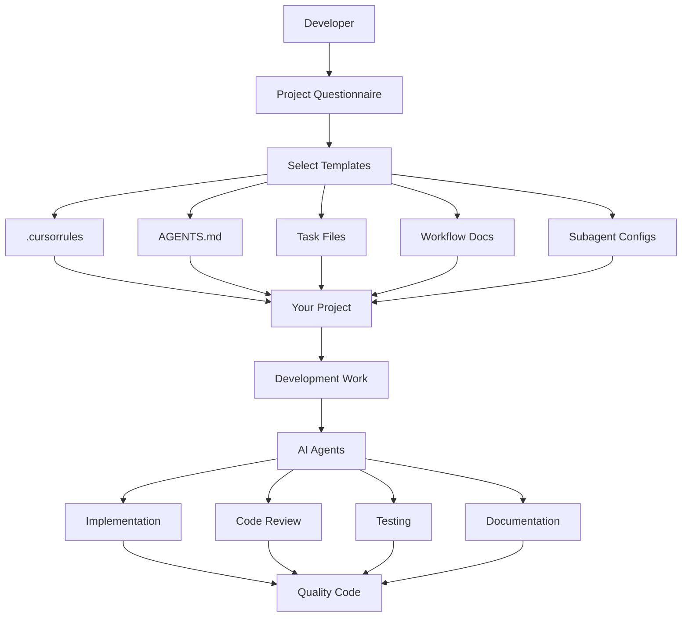

# Multi-Agent System Integration Guide

**Version**: 1.0.0  
**Last Updated**: January 2026

## 📖 Overview

This guide explains how all components of the multi-agent development system work together to enable collaborative, quality-driven development.

---

## 🏗️ System Architecture



---

## 🔗 Component Relationships

### 1. Project Questionnaire → Template Selection

**Flow**:
1. Fill out `PROJECT_QUESTIONNAIRE.md`
2. Identify project type, tech stack, architecture
3. Select appropriate templates based on answers

**Output**: Template selection guide (mobile/web/backend/full-stack)

---

### 2. Templates → Project Configuration

**Components**:
- **`.cursorrules`**: Defines project context for AI agents
- **`AGENTS.md`**: Defines agent roles and responsibilities
- **`tasks/*.yml`**: Defines implementation tasks
- **Workflow docs**: Define development processes
- **Subagent configs**: Define specialized AI assistants

**Integration**:
```
.cursorrules (project context)
     ↓
  AGENTS.md (agent roles)
     ↓
tasks/*.yml (specific tasks)
     ↓
Subagent configs (AI assistants)
```

---

### 3. .cursorrules ↔ AGENTS.md

**Relationship**: Complementary

**.cursorrules provides**:
- Project overview and philosophy
- Architecture patterns
- Technology stack
- Security requirements
- Code style conventions
- Testing strategy
- Documentation standards

**AGENTS.md provides**:
- Specific agent roles
- Agent responsibilities
- When to use which agent
- Agent collaboration patterns
- Quality checklists

**Integration**: Agents reference `.cursorrules` as the source of truth for project standards.

---

### 4. AGENTS.md ↔ Task Files

**Relationship**: Direct integration via `agent_roles` field

**Task File Example**:
```yaml
- id: FEATURE_T1_profile
  title: "Implement user profile"
  agent_roles:
    - implementation   # Maps to Implementation Agent in AGENTS.md
    - ui_ux           # Maps to UI/UX Agent in AGENTS.md
    - testing         # Maps to Testing Agent in AGENTS.md
```

**Integration**:
1. Task file specifies `agent_roles`
2. Agent reads `AGENTS.md` for their responsibilities
3. Agent follows checklist from `AGENTS.md`
4. Agent completes work per acceptance criteria in task

---

### 5. Task Files ↔ Subagent Configs

**Relationship**: Agents invoke subagents for specialized work

**Flow**:
1. Main agent reads task from `tasks/*.yml`
2. Agent determines work type (implementation, review, testing)
3. Agent invokes appropriate subagent (code-reviewer, designer, test-writer, etc.)
4. Subagent uses project context from `.cursorrules`
5. Subagent completes specialized work
6. Main agent integrates subagent output

**Example**:
```
Task: Implement user profile
    ↓
Implementation Agent (from AGENTS.md)
    ↓
Invokes flutter-specialist subagent
    ↓
flutter-specialist uses .cursorrules context
    ↓
Implements feature following project patterns
```

---

### 6. Workflow Docs → Development Process

**Relationship**: Guides day-to-day development

**MULTI_AGENT_WORKFLOW.md provides**:
- Sequential workflow patterns
- Parallel workflow patterns
- Agent handoff protocols
- Quality assurance checklists

**DEVELOPMENT_WORKFLOW.md provides**:
- Feature development process
- Code review guidelines
- Testing requirements
- Documentation standards

**Integration**: Both reference `.cursorrules` and `AGENTS.md` as authoritative sources.

---

## 🔄 Complete Development Flow

### Example: Implementing a New Feature

**Step 1: Task Creation**
```yaml
# tasks/03_user_features.yml
- id: USER_T1_profile_page
  title: "Implement user profile viewing"
  agent_roles: [implementation, ui_ux, testing]
  spec_refs:
    - "PDB: docs/specs/user_profile.md"
  acceptance_criteria:
    - "User can view their profile"
    - "UI follows design system"
    - "Tests cover main scenarios"
```

**Step 2: Implementation Agent Workflow**
1. **Read task file**: Understands requirements, checks `agent_roles`
2. **Check `.cursorrules`**: Reviews architecture pattern, code style
3. **Check `AGENTS.md`**: Reviews Implementation Agent responsibilities
4. **Invoke flutter-specialist**: Gets Flutter-specific implementation help
5. **Implement feature**: Follows project patterns
6. **Update task**: Marks `status: in_progress` → `done` when criteria met

**Step 3: Automatic Code Review**
- **code-reviewer subagent** automatically activates
- Reviews against `.cursorrules` standards
- Checks architecture compliance from `AGENTS.md`
- Provides feedback (Critical / Warnings / Suggestions)

**Step 4: UI/UX Review** (if `ui_ux` in `agent_roles`)
- UI/UX Agent reviews design system compliance
- Checks accessibility requirements
- Validates responsive design
- Ensures visual consistency

**Step 5: Testing** (if `testing` in `agent_roles`)
- Testing Agent reviews test coverage
- **test-writer subagent** creates missing tests
- Ensures unit, widget, and integration tests present
- Validates coverage meets target

**Step 6: Documentation** (if needed)
- **doc-generator subagent** adds documentation
- Updates feature docs in `docs/`
- Adds inline code documentation
- Updates README if needed

---

## 💡 Best Practices for Integration

### 1. Start with Context

Before any work:
1. Read `.cursorrules` → Understand project standards
2. Read `AGENTS.md` → Understand agent responsibilities
3. Read task file → Understand specific requirements
4. Check workflow docs → Understand process

### 2. Use Agent Roles Consistently

In task files, always specify `agent_roles`:
```yaml
agent_roles: [implementation, testing]  # Clear who works on this
```

### 3. Reference Documentation Explicitly

In tasks, reference specific docs:
```yaml
spec_refs:
  - "PDB: docs/product_design/app_pdb.md — Section 3.2"
  - "Design: Figma link"
  - "Docs: docs/architecture/PATTERNS.md"
```

### 4. Maintain Consistency

- **`.cursorrules`**: Single source of truth for standards
- **`AGENTS.md`**: Single source of truth for agent roles
- **Task files**: Single source of truth for work items
- **Workflow docs**: Single source of truth for processes

### 5. Leverage Subagents

Let subagents handle specialized work:
- **code-reviewer**: Automatic code review
- **designer**: UI/UX, design system, accessibility review
- **test-writer**: Test generation
- **debugger**: Error investigation
- **doc-generator**: Documentation
- **security-auditor**: Security review
- **performance-optimizer**: Performance optimization
- **{project}-specialist**: Project-specific patterns

---

## 🔍 Troubleshooting Integration Issues

### Issue: Agents Not Following Project Standards

**Cause**: `.cursorrules` not comprehensive or up-to-date

**Solution**:
1. Review `.cursorrules` for completeness
2. Add missing project-specific patterns
3. Ensure examples are clear and specific

### Issue: Agents Giving Conflicting Advice

**Cause**: Agent roles overlapping or unclear

**Solution**:
1. Review `AGENTS.md` role definitions
2. Clarify agent responsibilities
3. Establish priority (e.g., specialist > generic agent)

### Issue: Subagents Not Activating

**Cause**: Description in subagent YAML frontmatter not specific enough

**Solution**:
1. Review subagent `description` field
2. Ensure it mentions "Use proactively when..."
3. Make description specific to activation scenarios

### Issue: Task Context Not Clear

**Cause**: Task file missing key information

**Solution**:
1. Ensure `spec_refs` point to specific docs
2. Add detailed `description` with context
3. Make `acceptance_criteria` specific and testable
4. Specify `code_areas` for reference

---

## 📊 Success Metrics

Your integration is successful when:

✅ Agents automatically follow `.cursorrules` standards
✅ Agent roles from `AGENTS.md` are clear and non-overlapping
✅ Tasks have clear `agent_roles` assignments
✅ Subagents activate appropriately
✅ Code reviews happen automatically
✅ Documentation stays current
✅ Test coverage meets targets
✅ Development velocity increases
✅ Code quality improves

---

## 🔗 Related Documentation

- [SETUP_GUIDE.md](../SETUP_GUIDE.md) - Initial setup instructions
- [PROJECT_QUESTIONNAIRE.md](../PROJECT_QUESTIONNAIRE.md) - Project identification
- [CUSTOMIZATION_GUIDE.md](./CUSTOMIZATION_GUIDE.md) - How to customize templates
- [TROUBLESHOOTING.md](./TROUBLESHOOTING.md) - Common issues and solutions
- [FAQ.md](./FAQ.md) - Frequently asked questions

---

**Questions?** See [FAQ.md](./FAQ.md) or [TROUBLESHOOTING.md](./TROUBLESHOOTING.md)

**Version History**:
- 1.0.0 (Jan 2026) - Initial integration guide
